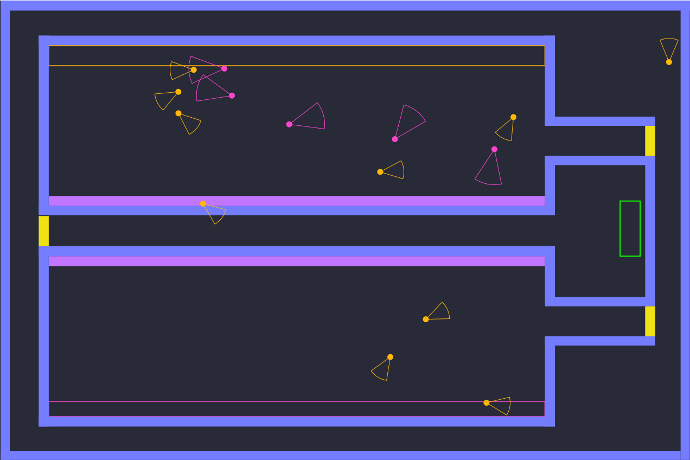
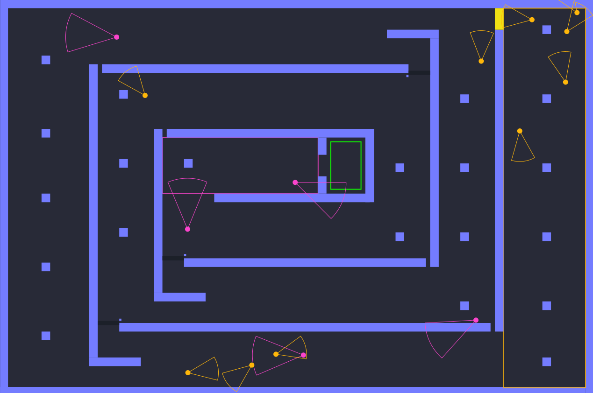

You can build agents of our group trough `Group6.AgentsFactory`.

We provide also factory specific to Group 9 code `Group6.AgentsFactory.getIAgentFactoryInstance`.

Also, please review `AllTests.testAgentsFactory`. 

This test makes sure that each group `AgentsFactory` can compile and that it can be executed. 

We have also made maps that may be interesting for competition:

### Temple

### Mirror

### Open

### Rooms

### Spiral
